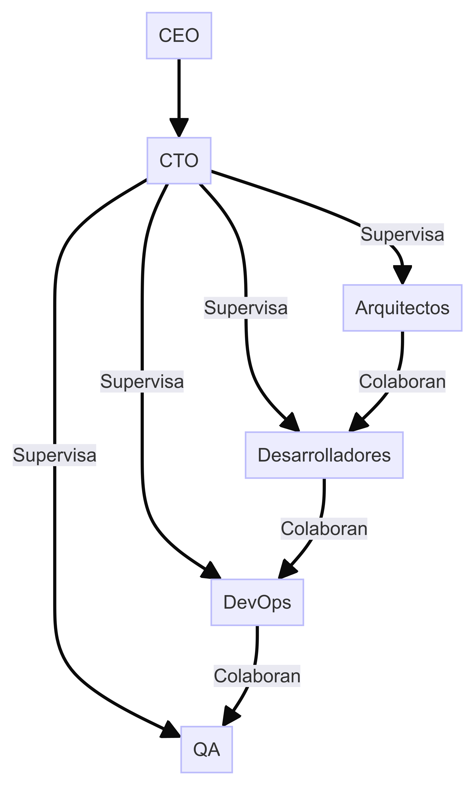
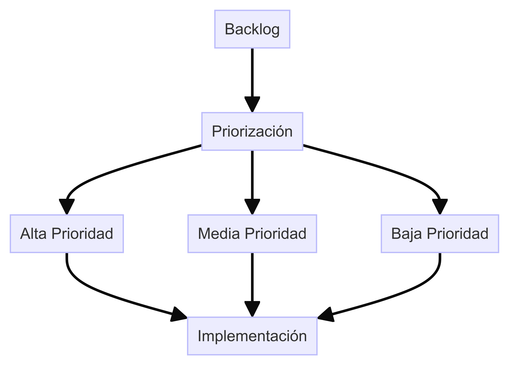
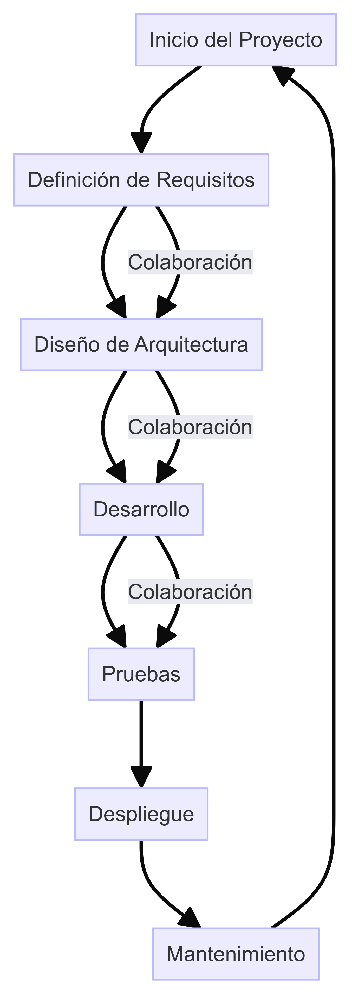
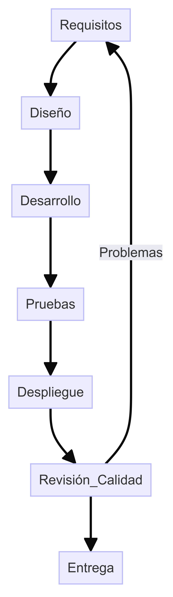

# Administración de Equipos y Coordinación

## 1. Introducción

**Objetivo:** Definir las estrategias y procesos para la administración y coordinación de los equipos de trabajo en DemoCompany, asegurando la eficiencia y calidad en la entrega de proyectos.

## 2. Definición de Roles y Backlog de Trabajo

### 2.1 Descripción de Roles y Responsabilidades

#### Arquitectos

- **Responsabilidades:**
  - Diseñar y actualizar el modelo de arquitectura.
  - Supervisar la implementación de cambios arquitectónicos.
  - Asegurar la alineación de la arquitectura con los objetivos estratégicos de la empresa.

#### Desarrolladores

- **Responsabilidades:**
  - Implementar los cambios arquitectónicos.
  - Realizar pruebas unitarias y de integración.
  - Documentar el código y los cambios realizados.

#### Ingenieros de DevOps

- **Responsabilidades:**
  - Gestionar la infraestructura de desarrollo y producción.
  - Automatizar procesos de CI/CD.
  - Monitorear el rendimiento y la estabilidad del sistema.

#### Ingenieros de QA

- **Responsabilidades:**
  - Diseñar e implementar planes de pruebas.
  - Realizar pruebas funcionales, de integración y de rendimiento.
  - Documentar y reportar los resultados de las pruebas.

### 2.2 Backlog de Trabajo Detallado y Priorizado

#### Ejemplo de Backlog

| ID  | Tarea                                     | Prioridad | Responsable    | Estado     |
|-----|-------------------------------------------|-----------|----------------|------------|
| 001 | Diseñar modelo de microservicios          | Alta      | Arquitectos    | En Proceso |
| 002 | Implementar CI/CD pipeline                | Media     | DevOps         | Pendiente  |
| 003 | Migrar base de datos a la nube            | Alta      | Desarrolladores| En Proceso |
| 004 | Realizar pruebas de carga                 | Media     | QA             | Pendiente  |
| 005 | Documentar arquitectura                   | Baja      | Arquitectos    | Completado |

## 3. Fomento de Sinergia entre Áreas

### 3.1 Plan de Sinergia y Colaboración

- **Reuniones Interdepartamentales:** Reuniones periódicas entre equipos de diferentes áreas para discutir avances, problemas y coordinar actividades.
- **Proyectos Colaborativos:** Asignar proyectos que requieran la colaboración de múltiples áreas para fomentar la cooperación y el trabajo en equipo.
- **Capacitación Cruzada:** Programas de capacitación que permitan a los empleados aprender sobre las funciones y responsabilidades de otras áreas.

### 3.2 Reportes de Entregables y Calidad

- **Frecuencia:** Semanal y mensual.
- **Contenido:** Avances en los proyectos, calidad de los entregables, problemas identificados y acciones correctivas.
- **Distribución:** Enviados a todos los equipos y departamentos involucrados.

## 4. Diagramas

### Diagrama de Estructura del Equipo

### Diagrama de Backlog y Priorización

### Diagrama de Flujo de Trabajo Colaborativo

### Diagrama de Revisión de Calidad de Entregables

## 5. Conclusión

La administración efectiva de equipos y la coordinación entre áreas son fundamentales para el éxito de los proyectos en DemoCompany. Al definir roles claros, priorizar tareas y fomentar la sinergia, se puede asegurar la eficiencia y la calidad en la entrega de proyectos.

---

**Enlaces Relacionados:**
- [Plan de Sinergia y Colaboración](docs/Plan_Sinergia_Colaboracion.md)
- [Backlog de Trabajo](docs/Backlog_de_Trabajo.md)
- [Reportes de Entregables y Calidad](docs/Reportes_Entregables_Calidad.md)
