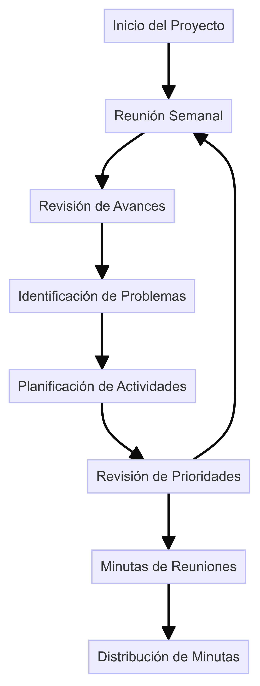
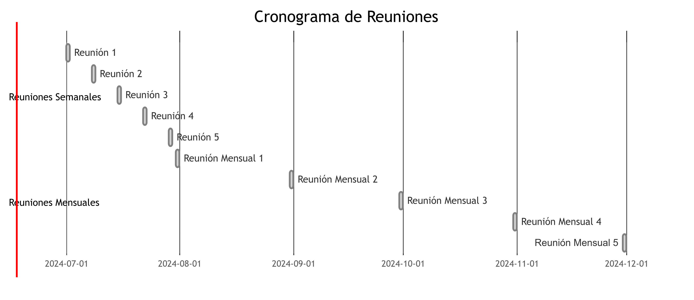

# Colaboración Interdepartamental

## 1. Introducción

**Objetivo:** Facilitar la colaboración entre departamentos para asegurar la alineación entre el modelo de arquitectura y su implementación física, mejorando la eficiencia y efectividad en DemoCompany.

## 2. Establecimiento de Reuniones y Canales de Comunicación

### 2.1 Plan de Comunicación Interdepartamental

- **Frecuencia:** Reuniones semanales y mensuales.
- **Participantes:** Representantes de cada departamento (TI, seguridad informática, base de datos, operaciones, mantenimiento).
- **Objetivo:** Discutir avances, identificar problemas, coordinar actividades y asegurar alineación.

### 2.2 Agenda y Minutas de Reuniones

- **Agenda:** 
  - Revisión de avances.
  - Identificación de problemas y obstáculos.
  - Planificación de actividades.
  - Revisión de prioridades y objetivos.
- **Minutas:** Registro de las discusiones, decisiones y acciones acordadas. Distribuidas a todos los participantes después de cada reunión.

### 2.3 Canales de Comunicación

- **Correo Electrónico:** Comunicación oficial y distribución de documentos.
- **Chat Corporativo (e.g., Slack, Microsoft Teams):** Comunicación rápida y coordinación diaria.
- **Portal de Colaboración (e.g., Confluence):** Documentación, agendas, minutas y recursos compartidos.

## 3. Alineación entre el Modelo de Arquitectura y su Implementación

### 3.1 Guía de Alineación entre Arquitectura y Operaciones

**Descripción:** Documentación que define cómo debe alinearse la arquitectura con las operaciones diarias y cómo se implementarán los cambios arquitectónicos.

- **Roles y Responsabilidades:** 
  - Arquitectos: Definir y actualizar el modelo de arquitectura.
  - Desarrolladores: Implementar los cambios arquitectónicos.
  - Operaciones: Garantizar que los cambios se integren sin afectar la producción.
- **Procesos:** 
  - Revisión de cambios: Evaluar los impactos antes de la implementación.
  - Pruebas de integración: Asegurar que los cambios funcionen en el entorno real.

### 3.2 Reportes de Progreso y Alineación

- **Frecuencia:** Mensual.
- **Contenido:** 
  - Avances en la implementación del modelo de arquitectura.
  - Identificación de problemas y desviaciones.
  - Acciones correctivas y recomendaciones.
- **Distribución:** Enviados a todos los departamentos involucrados.

## 4. Diagramas

### Diagrama de Flujo de Comunicación

### Ejemplo de Cronograma de Reuniones

## 5. Conclusión

La colaboración interdepartamental es crucial para asegurar que el modelo de arquitectura se implemente de manera efectiva y sin problemas en DemoCompany. El establecimiento de reuniones regulares, canales de comunicación eficientes y una guía clara de alineación entre arquitectura y operaciones garantizarán el éxito de esta colaboración.

---

**Enlaces Relacionados:**
- [Plan de Comunicación Interdepartamental](docs/Plan_Comunicacion_Interdepartamental.md)
- [Guía de Alineación entre Arquitectura y Operaciones](docs/Guia_Aliniacion_Arquitectura_Operaciones.md)
- [Reportes de Progreso y Alineación](docs/Reportes_Progreso_Aliniacion.md)
