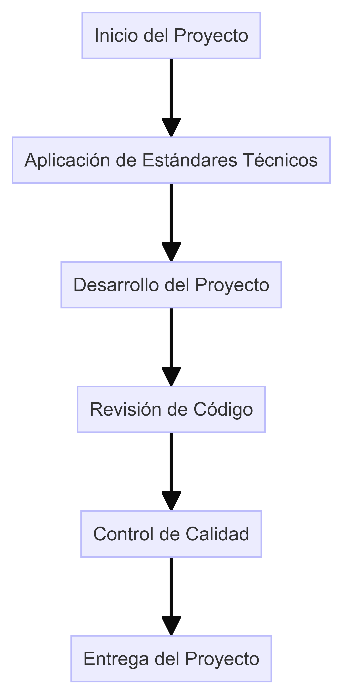
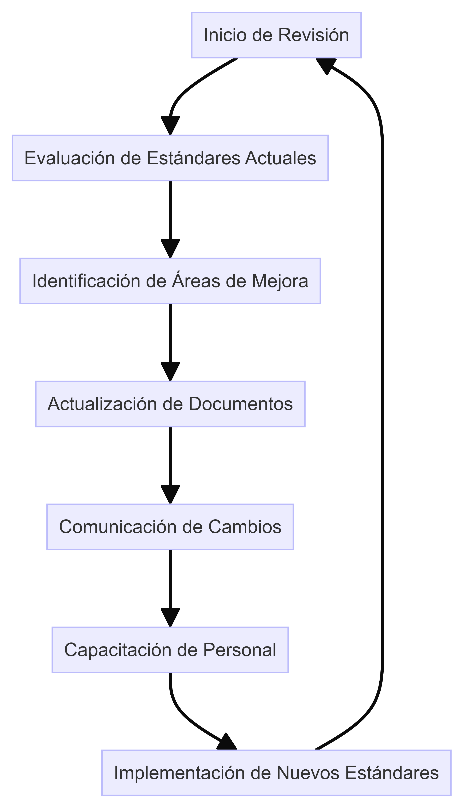

# Definición y Documentación de Estándares

## 1. Introducción

**Objetivo:** Definir y documentar los estándares técnicos y de proceso para asegurar la coherencia y calidad en el desarrollo y mantenimiento de sistemas en DemoCompany.

## 2. Estándares Técnicos

### 2.1 Estándares de Codificación

- **Lenguajes de Programación:** Java, Python, JavaScript.
- **Convenciones de Nombres:** Uso de camelCase para variables y métodos, PascalCase para clases.
- **Formato de Código:** Indentación de 4 espacios, líneas de código no deben exceder 80 caracteres.
- **Comentarios:** Uso de comentarios Javadoc para documentación de clases y métodos.

### 2.2 Estándares de Seguridad

- **Autenticación y Autorización:** Implementación de OAuth 2.0 y OpenID Connect.
- **Encriptación:** Uso de TLS 1.2 o superior para comunicaciones, AES-256 para almacenamiento de datos sensibles.
- **Gestión de Vulnerabilidades:** Escaneo regular de vulnerabilidades utilizando herramientas como OWASP ZAP.

### 2.3 Estándares de Integración

- **APIs RESTful:** Diseño de APIs siguiendo el estilo RESTful, uso de JSON para intercambio de datos.
- **Manejo de Errores:** Implementación de códigos de estado HTTP adecuados, mensajes de error claros y detallados.
- **Versionado:** Uso de versionado de APIs (v1, v2, etc.) para gestionar cambios.

## 3. Estándares de Proceso

### 3.1 Gestión de Proyectos

- **Metodologías:** Uso de metodologías ágiles (Scrum, Kanban).
- **Herramientas:** Jira para gestión de tareas, Confluence para documentación.
- **Reuniones:** Daily stand-ups, sprint planning, retrospectives.

### 3.2 Control de Calidad

- **Pruebas Unitarias:** Cobertura mínima del 80% del código.
- **Pruebas de Integración:** Pruebas automatizadas para verificar la interacción entre componentes.
- **Revisiones de Código:** Revisión de código obligatoria antes de cada merge a la rama principal.

## 4. Plantillas y Ejemplos

### 4.1 Plantillas

- **Plantilla de Documento de Diseño:** [Plantilla de Documento de Diseño](Plantilla_Documento_de_Diseno.md)
- **Plantilla de Revisión de Código:** [Plantilla de Revisión de Código](Plantilla_Revision_de_Codigo.md)
- **Plantilla de Informe de Pruebas:** [Plantilla de Informe de Pruebas](Plantilla_Informe_de_Pruebas.md)

### 4.2 Ejemplos

- **Ejemplo de Documento de Diseño:** [Ejemplo de Documento de Diseño](Ejemplo_Documento_de_Diseno.md)
- **Ejemplo de Revisión de Código:** [Ejemplo de Revisión de Código](Ejemplo_Revision_de_Codigo.md)
- **Ejemplo de Informe de Pruebas:** [Ejemplo de Informe de Pruebas](Ejemplo_Informe_de_Pruebas.md)

## 5. Diagramas

### Diagrama de Estándares y su Aplicación en Proyectos

### Diagrama de Revisión Periódica de Estándares

## 6. Revisión y Actualización de Estándares

### 6.1 Proceso de Revisión

- **Frecuencia:** Revisión trimestral de los estándares.
- **Responsables:** Equipo de Arquitectura y Seguridad.
- **Procedimiento:** Evaluación de la eficacia de los estándares, identificación de áreas de mejora, actualización de documentos.

### 6.2 Comunicación de Cambios

- **Anuncios:** Comunicación de cambios a través de correos electrónicos y reuniones.
- **Documentación:** Actualización de la documentación en Confluence.
- **Capacitación:** Sesiones de capacitación para asegurar la comprensión y adopción de los nuevos estándares.

## 7. Conclusión

La definición y documentación de estándares técnicos y de proceso es esencial para mantener la coherencia, calidad y seguridad en el desarrollo de sistemas en DemoCompany. Estos estándares proporcionan una guía clara para los equipos de desarrollo y aseguran el cumplimiento de las mejores prácticas de la industria.

---

**Enlaces Relacionados:**
- [Plantilla de Documento de Diseño](Plantilla_Documento_de_Diseno.md)
- [Plantilla de Revisión de Código](Plantilla_Revision_de_Codigo.md)
- [Plantilla de Informe de Pruebas](Plantilla_Informe_de_Pruebas.md)
- [Ejemplo de Documento de Diseño](Ejemplo_Documento_de_Diseno.md)
- [Ejemplo de Revisión de Código](Ejemplo_Revision_de_Codigo.md)
- [Ejemplo de Informe de Pruebas](Ejemplo_Informe_de_Pruebas.md)
