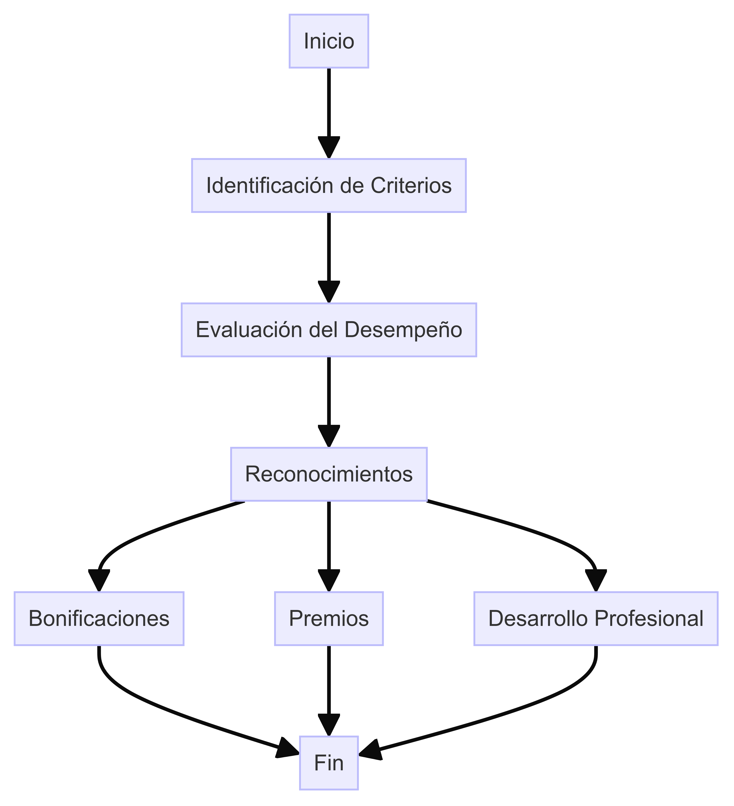
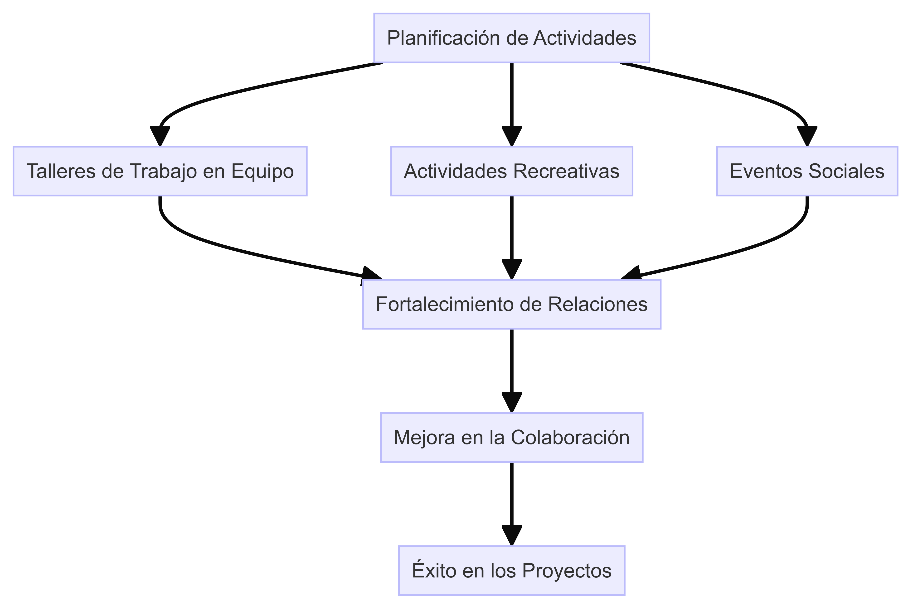
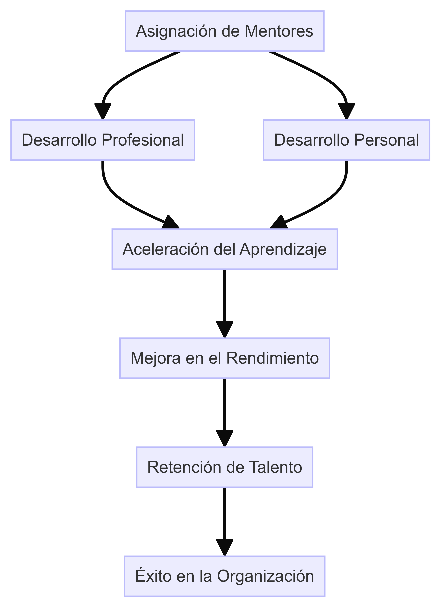

# Fomento de la Cultura de Excelencia

## 1. Introducción

**Objetivo:** Fomentar una cultura de excelencia arquitectónica dentro de DemoCompany, promoviendo la mejora continua, la colaboración y el aprendizaje.

## 2. Sistema de Reconocimiento y Recompensa

### 2.1 Política de Reconocimiento y Recompensa

- **Objetivo:** Motivar y reconocer a los empleados que demuestran excelencia en su trabajo.
- **Criterios:** Basados en el desempeño, la innovación, la colaboración y el impacto en el proyecto.
- **Tipos de Reconocimientos:** Bonificaciones, premios, menciones honoríficas, oportunidades de desarrollo profesional.

### 2.2 Ejemplos de Programas de Incentivos

#### Programa de Innovación

- **Descripción:** Premiar las ideas innovadoras que mejoren procesos, productos o servicios.
- **Incentivos:** Bonificaciones monetarias, premios, reconocimiento público.

#### Programa de Colaboración

- **Descripción:** Reconocer a los equipos o individuos que demuestran una colaboración excepcional.
- **Incentivos:** Premios en equipo, eventos de team-building, menciones en reuniones corporativas.

#### Programa de Mejora Continua

- **Descripción:** Incentivar la mejora continua en la calidad del trabajo y los procesos.
- **Incentivos:** Certificados de excelencia, oportunidades de formación y desarrollo.

## 3. Promoción de la Colaboración y Aprendizaje

### 3.1 Plan de Actividades de Team-Building

- **Objetivo:** Fortalecer las relaciones entre los miembros del equipo y mejorar la colaboración.
- **Actividades:** Talleres de trabajo en equipo, actividades recreativas, eventos sociales.
- **Frecuencia:** Trimestral.

### 3.2 Programa de Mentoría y Desarrollo Profesional

- **Objetivo:** Facilitar el desarrollo profesional y personal de los empleados a través de la mentoría.
- **Descripción:** Asignación de mentores a empleados para guiarlos en su desarrollo profesional.
- **Beneficios:** Aceleración del aprendizaje, mejora en el rendimiento, retención de talento.

## 4. Diagramas

### Diagrama del Sistema de Reconocimiento

### Diagrama del Plan de Actividades Colaborativas

### Diagrama del Programa de Mentoría

## 5. Conclusión

Fomentar una cultura de excelencia en DemoCompany es crucial para asegurar la calidad y el éxito de los proyectos. A través de un sistema de reconocimiento y recompensas, la promoción de la colaboración y el aprendizaje, se puede crear un entorno de trabajo motivador y productivo.

---

**Enlaces Relacionados:**
- [Sistema de Reconocimiento y Recompensa](docs/Sistema_Reconocimiento_Recompensa.md)
- [Plan de Actividades de Team-Building](docs/Plan_Actividades_Team_Building.md)
- [Programa de Mentoría y Desarrollo Profesional](docs/Programa_Mentoria_Desarrollo_Profesional.md)
