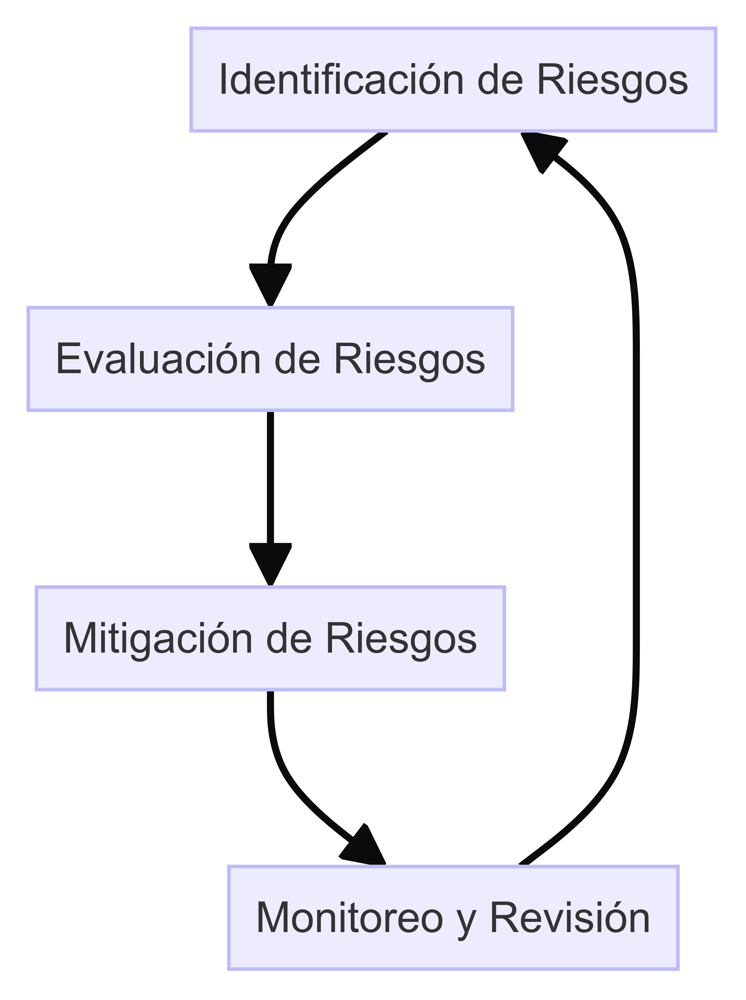
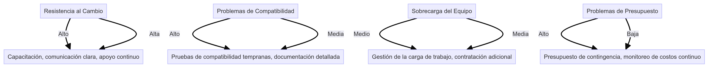

# Gestión de Riesgos

## 1. Introducción

**Objetivo:** Desarrollar un marco de gestión de riesgos para identificar, evaluar y mitigar los riesgos asociados con la implementación del plan de transformación arquitectónica en DemoCompany.

## 2. Desarrollo del Marco de Gestión de Riesgos

### 2.1 Política de Gestión de Riesgos

**Descripción:** La política de gestión de riesgos define los principios y enfoques para gestionar los riesgos de manera proactiva y sistemática.

- **Principios:** Identificación temprana, evaluación continua, mitigación proactiva.
- **Alcance:** Todos los proyectos y actividades relacionadas con la transformación arquitectónica.
- **Responsabilidades:** Equipo de Arquitectura y Seguridad, Gerentes de Proyecto.

### 2.2 Proceso de Gestión de Riesgos

**Etapas del Proceso:**
1. **Identificación de Riesgos:** Identificar riesgos potenciales que puedan afectar el proyecto.
2. **Evaluación de Riesgos:** Evaluar la probabilidad y el impacto de cada riesgo.
3. **Mitigación de Riesgos:** Desarrollar planes de acción para mitigar los riesgos.
4. **Monitoreo y Revisión:** Monitorear los riesgos y revisar la efectividad de las medidas de mitigación.

### 2.3 Herramientas y Técnicas

- **Análisis FODA:** Evaluar fortalezas, debilidades, oportunidades y amenazas.
- **Matriz de Riesgos:** Herramienta para evaluar y priorizar riesgos.
- **Planes de Contingencia:** Preparar planes alternativos para gestionar riesgos imprevistos.

## 3. Identificación de Riesgos

### 3.1 Riesgos Comunes

- **Resistencia al Cambio:** Los empleados pueden resistirse a adoptar nuevas tecnologías o procesos.
- **Problemas de Compatibilidad:** Las nuevas tecnologías pueden no ser compatibles con los sistemas existentes.
- **Sobrecarga del Equipo:** El equipo puede estar sobrecargado con el trabajo adicional requerido para la transformación.
- **Problemas de Presupuesto:** El proyecto puede exceder el presupuesto asignado.

### 3.2 Matriz de Riesgos

| Riesgo                | Impacto | Probabilidad | Mitigación                                          |
|-----------------------|---------|--------------|-----------------------------------------------------|
| Resistencia al Cambio | Alto    | Alta         | Capacitación, comunicación clara, apoyo continuo.    |
| Problemas de Compatibilidad | Alto    | Media        | Pruebas de compatibilidad tempranas, documentación detallada. |
| Sobrecarga del Equipo | Medio   | Media        | Gestión de la carga de trabajo, contratación adicional. |
| Problemas de Presupuesto | Alto    | Baja         | Presupuesto de contingencia, monitoreo de costos continuo. |

## 4. Mitigación de Riesgos

### 4.1 Plan de Acción

- **Resistencia al Cambio:** Implementar un programa de capacitación integral y mantener una comunicación clara y constante con el personal.
- **Problemas de Compatibilidad:** Realizar pruebas de compatibilidad tempranas y documentar los resultados detalladamente.
- **Sobrecarga del Equipo:** Gestionar la carga de trabajo de manera efectiva y considerar la contratación de personal adicional si es necesario.
- **Problemas de Presupuesto:** Establecer un presupuesto de contingencia y monitorear los costos continuamente.

### 4.2 Planes de Contingencia

- **Riesgo:** Resistencia al Cambio.
  - **Contingencia:** Implementar medidas de incentivo para la adopción de nuevas tecnologías.
- **Riesgo:** Problemas de Compatibilidad.
  - **Contingencia:** Desarrollar soluciones alternativas y parches para resolver problemas de compatibilidad.
- **Riesgo:** Sobrecarga del Equipo.
  - **Contingencia:** Redistribuir las tareas y contratar personal temporal si es necesario.
- **Riesgo:** Problemas de Presupuesto.
  - **Contingencia:** Negociar con proveedores y buscar fuentes adicionales de financiamiento.

## 5. Comunicación con las Áreas de Negocio

### 5.1 Informe de Riesgos Periódicos

- **Frecuencia:** Mensual
- **Contenido:** Estado actual de los riesgos, nuevas identificaciones de riesgos, efectividad de las medidas de mitigación.
- **Distribución:** Enviado a los gerentes de proyecto y a la alta dirección.

### 5.2 Planes de Contingencia y Acciones Correctivas

- **Descripción:** Descripción detallada de los planes de contingencia y las acciones correctivas para cada riesgo identificado.
- **Implementación:** Coordinación con las áreas de negocio para implementar las acciones correctivas de manera efectiva.

## 6. Diagramas

### Diagrama del Proceso de Gestión de Riesgos

### Matriz de Riesgos

## 7. Conclusión

El marco de gestión de riesgos es fundamental para asegurar el éxito del plan de transformación arquitectónica en DemoCompany. La identificación temprana, evaluación continua y mitigación proactiva de riesgos ayudarán a minimizar el impacto de los riesgos y asegurar la continuidad del proyecto.

---

**Enlaces Relacionados:**
- [Análisis FODA](Analisis_FODA.md)
- [Matriz de Riesgos](Matriz_de_Riesgos.md)
- [Planes de Contingencia](Planes_de_Contingencia.md)
