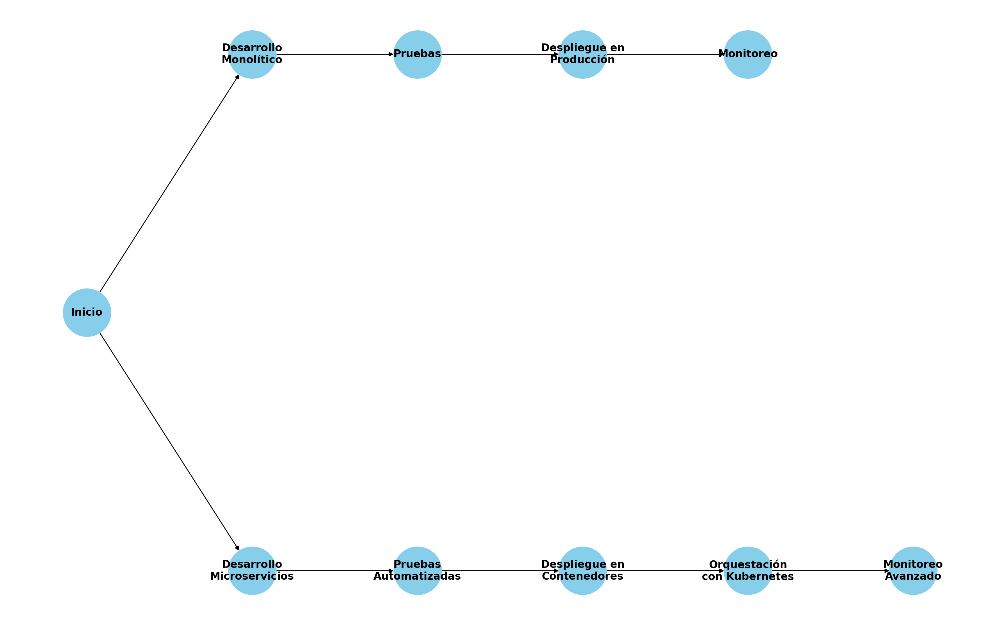

# Identificación de Brechas y Oportunidades

## 1. Introducción

**Objetivo:**
Identificar las brechas tecnológicas y oportunidades de mejora en la arquitectura tecnológica de DemoCompany, basándose en la evaluación del estado actual y alineándose con el marco de trabajo TOGAF.

## 2. Brechas Tecnológicas

**Phase B: Business Architecture**

**2.1 Falta de Escalabilidad**

- **Descripción:** La arquitectura actual es monolítica, lo que dificulta la escalabilidad y flexibilidad necesarias para responder a las demandas del negocio.
- **Impacto:** Limitada capacidad para manejar aumentos en la carga de trabajo y dificultad para implementar cambios rápidos.
- **Evidencia:** Observaciones durante la evaluación del estado actual y comparación con estándares de la industria.

**2.2 Dependencia de Tecnologías Obsoletas**

- **Descripción:** Uso de servidores físicos y tecnologías desactualizadas que no son fácilmente escalables ni flexibles.
- **Impacto:** Mayores costos operativos y mantenimiento, y riesgo de fallos en el sistema.
- **Evidencia:** Revisión de la infraestructura tecnológica y comparación con prácticas modernas.

**2.3 Procesos de CI/CD Insuficientemente Automatizados**

- **Descripción:** Los procesos de CI/CD actuales no están totalmente automatizados, lo que ralentiza el ciclo de desarrollo y despliegue.
- **Impacto:** Despliegues más lentos y propensión a errores humanos.
- **Evidencia:** Análisis de los procesos actuales y comparación con mejores prácticas en la industria.

## 3. Oportunidades de Mejora

**Phase B: Business Architecture**

**3.1 Migración a una Arquitectura de Microservicios**

- **Descripción:** Adopción de una arquitectura de microservicios para mejorar la escalabilidad y resiliencia del sistema.
- **Beneficios:** Mayor flexibilidad, escalabilidad y facilidad para realizar cambios y mejoras.
- **Evidencia:** Análisis de tendencias de la industria y casos de éxito similares.

**3.2 Implementación de Kubernetes para la Orquestación de Contenedores**

- **Descripción:** Uso de Kubernetes para la orquestación de contenedores, facilitando la gestión y despliegue de aplicaciones.
- **Beneficios:** Mejor gestión de recursos, mayor disponibilidad y resiliencia.
- **Evidencia:** Comparación de herramientas de orquestación y análisis de beneficios operacionales.

**3.3 Mejora de los Procesos de CI/CD**

- **Descripción:** Implementación de herramientas avanzadas y optimización de pipelines para mejorar los procesos de CI/CD.
- **Beneficios:** Despliegues más rápidos, reducción de errores y mayor eficiencia.
- **Evidencia:** Análisis de herramientas y técnicas avanzadas de CI/CD.

## 4. Plan de Acción para Abordar Brechas

**Phase E: Opportunities and Solutions**

**4.1 Acciones a Corto Plazo**

- **Actualización de Tecnologías Obsoletas:**
  - **Descripción:** Reemplazar servidores físicos y tecnologías desactualizadas por soluciones modernas.
  - **Plazo:** 3 meses
  - **Responsables:** Equipo de Infraestructura
  - **Indicadores de Éxito:** Reducción de costos operativos y mejoras en la flexibilidad del sistema.

- **Automatización de Procesos de CI/CD:**
  - **Descripción:** Implementar herramientas avanzadas de CI/CD y optimizar pipelines existentes.
  - **Plazo:** 3 meses
  - **Responsables:** Equipo de DevOps
  - **Indicadores de Éxito:** Reducción del tiempo de despliegue y errores en los despliegues.

**4.2 Acciones a Mediano Plazo**

- **Migración a Microservicios:**
  - **Descripción:** Descomponer aplicaciones monolíticas en microservicios independientes.
  - **Plazo:** 6-12 meses
  - **Responsables:** Equipos de Desarrollo y Arquitectura
  - **Indicadores de Éxito:** Mejora en la escalabilidad y flexibilidad del sistema.

- **Implementación de Kubernetes:**
  - **Descripción:** Adoptar Kubernetes para la orquestación de contenedores en entornos de producción.
  - **Plazo:** 6-12 meses
  - **Responsables:** Equipos de DevOps y Operaciones
  - **Indicadores de Éxito:** Mejora en la gestión de recursos y disponibilidad del sistema.

**4.3 Acciones a Largo Plazo**

- **Implementación de una Estrategia de Nube Híbrida:**
  - **Descripción:** Adoptar servicios en la nube como AWS o Azure para gestionar cargas de trabajo dinámicas.
  - **Plazo:** 12-24 meses
  - **Responsables:** Equipos de Arquitectura y Operaciones
  - **Indicadores de Éxito:** Mejora en la flexibilidad y escalabilidad del sistema.

## 5. Diagramas

### Diagrama de Flujo de Trabajo Actual vs. Propuesto

## 6. Conclusiones

**Resumen:**
Las brechas identificadas representan áreas críticas que deben abordarse para mejorar la arquitectura tecnológica de DemoCompany. Las oportunidades de mejora y el plan de acción propuesto están diseñados para cerrar estas brechas y avanzar hacia una arquitectura más moderna y eficiente.

## Anexos

**Anexo A: [Metodología Utilizada para la Evaluación](docs/Anexo_A_Metodologia_Utilizada_para_la_Evaluacion.md)**

**Anexo B: [Herramientas y Recursos Recomendados](docs/Anexo_B_Herramientas_y_Recursos_Recomendados.md)**
