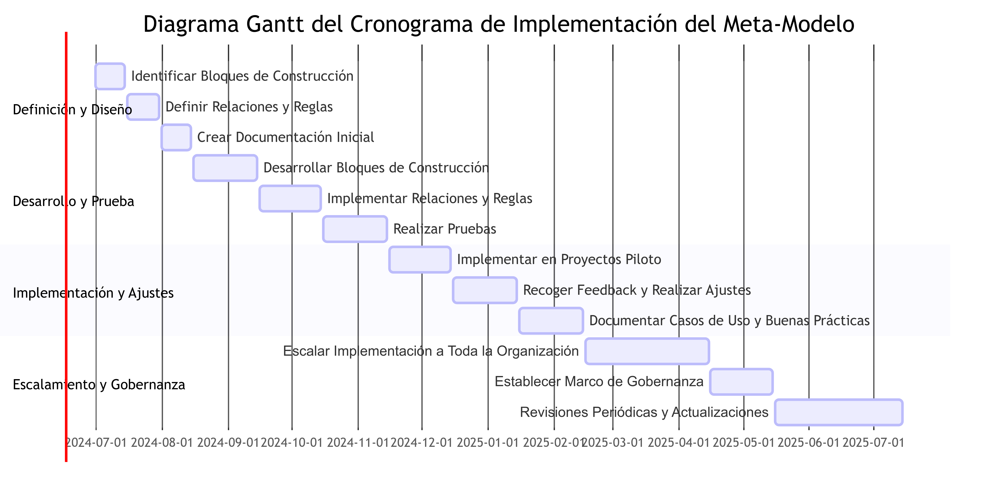

# Implementación del Meta-Modelo de Arquitectura

## 1. Introducción

**Objetivo:** Crear e implementar un meta-modelo de arquitectura para DemoCompany que permita el reúso óptimo y la modularidad de los bloques de construcción en sistemas, reduciendo costos y tiempos de implementación.

## 2. Creación del Meta-Modelo

### 2.1 Descripción del Meta-Modelo

**Definición:** Un meta-modelo de arquitectura es un marco que define los componentes, relaciones y reglas necesarios para construir arquitecturas coherentes y reutilizables.

**Componentes del Meta-Modelo:**
- **Bloques de Construcción:** Elementos modulares y reutilizables que representan funciones o servicios específicos.
- **Relaciones:** Conexiones y dependencias entre los bloques de construcción.
- **Reglas:** Directrices y estándares para la integración y uso de los bloques de construcción.

### 2.2 Guía de Implementación

**Pasos:**
1. **Definición de Bloques de Construcción:** Identificar y definir los bloques de construcción necesarios.
2. **Establecimiento de Relaciones:** Definir cómo interactúan y se conectan los bloques de construcción.
3. **Definición de Reglas y Estándares:** Establecer directrices para la creación, integración y uso de los bloques de construcción.
4. **Documentación:** Crear documentación detallada del meta-modelo, incluyendo diagramas y descripciones de los componentes.

### 2.3 Beneficios

- **Reutilización:** Facilita la reutilización de componentes en diferentes proyectos.
- **Modularidad:** Permite una estructura modular que es fácil de gestionar y actualizar.
- **Eficiencia:** Reduce los costos y tiempos de implementación al utilizar componentes predefinidos y estandarizados.

## 3. Plan de Implementación Faseado

### 3.1 Fases del Plan

**Fase 1: Definición y Diseño**

- **Actividades:**
  - Identificar los bloques de construcción necesarios.
  - Definir las relaciones y reglas del meta-modelo.
  - Crear la documentación inicial del meta-modelo.
- **Duración:** 2 meses

**Fase 2: Desarrollo y Prueba**

- **Actividades:**
  - Desarrollar los bloques de construcción.
  - Implementar relaciones y reglas definidas.
  - Realizar pruebas para asegurar la funcionalidad y cohesión del meta-modelo.
- **Duración:** 3 meses

**Fase 3: Implementación y Ajustes**

- **Actividades:**
  - Implementar el meta-modelo en proyectos piloto.
  - Recoger feedback y realizar ajustes necesarios.
  - Documentar casos de uso y mejores prácticas.
- **Duración:** 3 meses

**Fase 4: Escalamiento y Gobernanza**

- **Actividades:**
  - Escalar la implementación del meta-modelo a toda la organización.
  - Establecer un marco de gobernanza para asegurar el cumplimiento y evolución del meta-modelo.
  - Realizar revisiones periódicas y actualizaciones del meta-modelo.
- **Duración:** 4 meses

### 3.2 Cronograma de Implementación

## 4. Modelo de Arquitectura C4

El modelo de arquitectura C4 es una forma de describir la arquitectura de software en diferentes niveles de abstracción, desde una vista de alto nivel del sistema hasta los detalles de los componentes individuales. A continuación, se presentan las vistas C4 para el meta-modelo de arquitectura de DemoCompany.

### 4.1 Diagrama de Contexto

**Descripción:** Muestra cómo el sistema se relaciona con sus usuarios y otros sistemas externos.

### 4.2 Diagrama de Contenedores

**Descripción:** Muestra los contenedores que forman el sistema, cómo se comunican y sus relaciones con los usuarios externos y otros sistemas.

### 4.3 Diagrama de Componentes

**Descripción:** Muestra los componentes dentro de cada contenedor, sus relaciones y cómo interactúan para cumplir los requisitos del sistema.

### 4.4 Diagrama de Código

**Descripción:** Muestra los detalles de implementación de un componente específico, incluyendo clases, interfaces y otros elementos de código.

## 5. Documentación y Recursos

### 5.1 Documentos

- **[Guía del Meta-Modelo](docs/Guia_del_Meta_Modelo.md):** Documentación detallada del meta-modelo, incluyendo definiciones, relaciones y reglas.
- **[Manuales de Usuario](docs/Manuales_de_Usuario.md):** Guías para desarrolladores y arquitectos sobre cómo utilizar el meta-modelo.
- **[Casos de Uso](docs/Casos_de_Uso.md):** Ejemplos de implementación del meta-modelo en diferentes proyectos.

### 5.2 Herramientas

- **Herramientas de Modelado:** Herramientas para diseñar y documentar el meta-modelo (e.g., Archi, Sparx Systems Enterprise Architect).
- **Repositorios de Código:** Repositorios para almacenar y gestionar los bloques de construcción (e.g., GitHub, GitLab).

## 6. Conclusión

La implementación de un meta-modelo de arquitectura en DemoCompany permitirá una mayor eficiencia y coherencia en el desarrollo de sistemas, facilitando el reúso y la modularidad de los componentes. Este enfoque reducirá los costos y tiempos de implementación, mejorando la capacidad de la organización para responder a las demandas del mercado.

---

**Enlaces Relacionados:**
- [Guía del Meta-Modelo](docs/Guia_del_Meta_Modelo.md)
- [Manuales de Usuario](docs/Manuales_de_Usuario.md)
- [Casos de Uso](docs/Casos_de_Uso.md)
