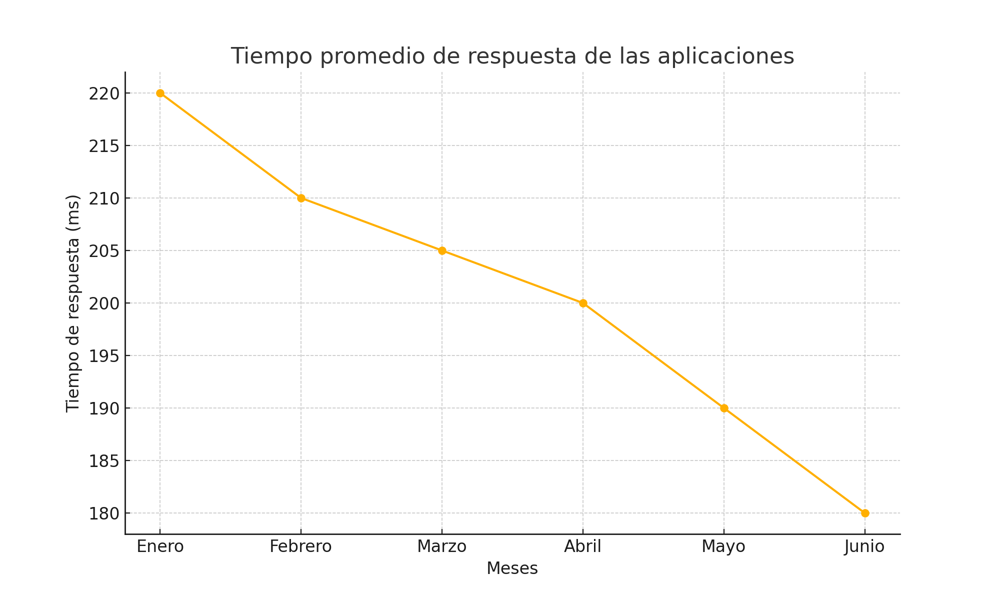
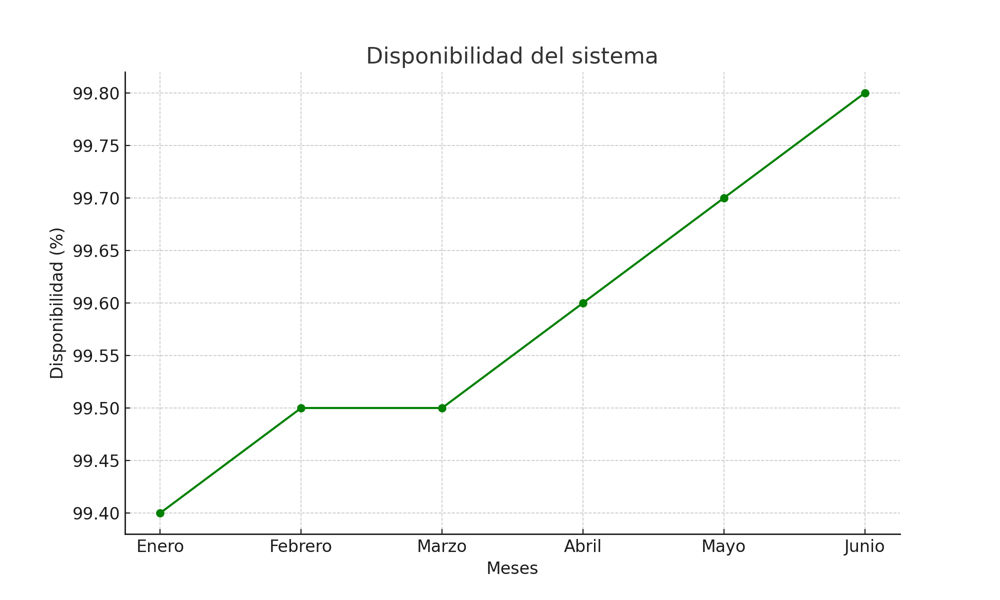
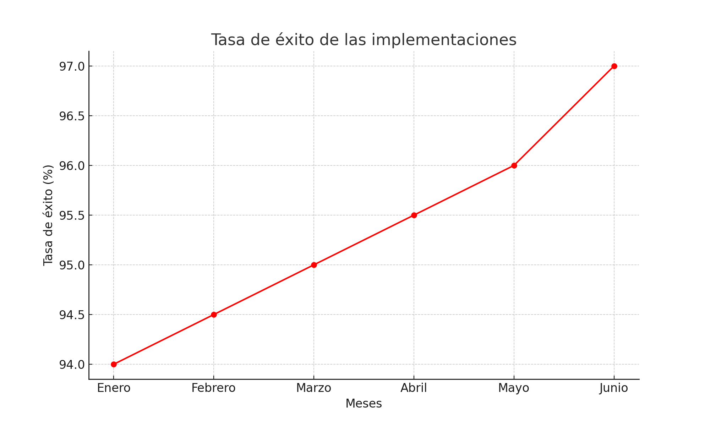
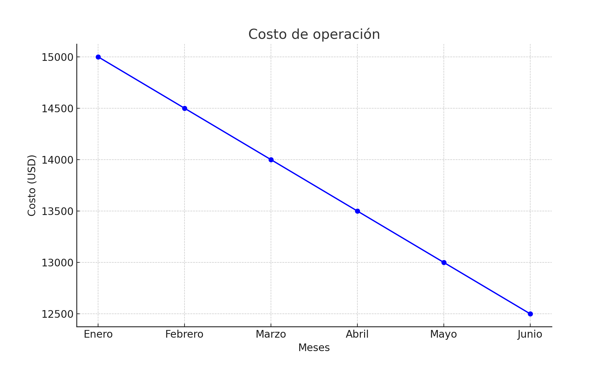
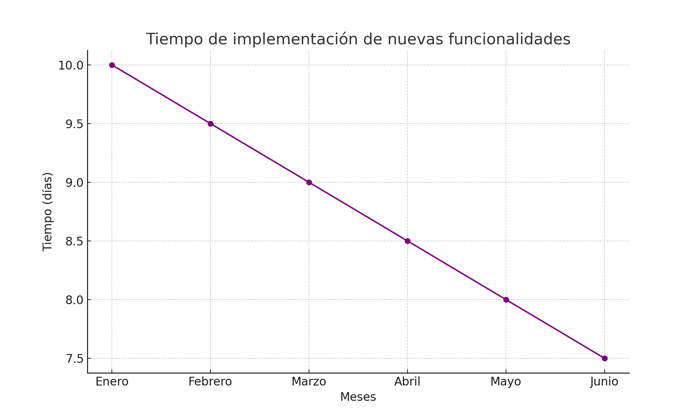

# Informe de Evaluación del Estado Actual de la Arquitectura

## 1. Introducción

**Contexto y objetivos de la evaluación:**
La arquitectura tecnológica de DemoCompany necesita ser evaluada para identificar áreas de mejora y garantizar que las soluciones arquitectónicas satisfagan las necesidades actuales y futuras del negocio. Este informe sigue el marco de trabajo TOGAF, específicamente las fases de la Preliminary Phase, Architecture Vision y Current State Assessment.

## 2. Evaluación del Estado Actual

**Preliminary Phase y Architecture Vision**

**Descripción de la infraestructura actual:**
La infraestructura actual de DemoCompany está compuesta por una mezcla de servidores físicos y virtuales. Las aplicaciones principales están construidas con una arquitectura monolítica desplegada en servidores on-premises.

**Tecnologías utilizadas:**
- **Backend:** Java, Spring Framework
- **Frontend:** Angular, HTML, CSS
- **Base de datos:** Oracle, MySQL
- **Contenedorización:** Docker
- **Orquestación de contenedores:** Kubernetes (en entornos de prueba)
- **CI/CD:** Jenkins, Git
- **Monitorización y Logging:** New Relic, Datadog, ELK Stack (Elasticsearch, Logstash, Kibana)

**Procesos y metodologías actuales:**
Los equipos de desarrollo siguen una metodología ágil (Scrum) con sprints de dos semanas y utilizan Jira para la gestión de tareas. Se realizan reuniones diarias (stand-ups) y retrospectivas al final de cada sprint.

## 3. Análisis de Desempeño

**Phase B: Business Architecture**

**Indicadores clave de desempeño:**
- **Tiempo promedio de respuesta de las aplicaciones:** 200 ms.
- **Disponibilidad del sistema:** 99.5%.
- **Tasa de éxito de las implementaciones:** 95%.

**Métodos y herramientas utilizados:**
- **Herramientas de monitorización:** New Relic y Datadog fueron configuradas para rastrear métricas de rendimiento, como el tiempo de respuesta de las aplicaciones y la disponibilidad del sistema. Los datos fueron recolectados y analizados durante un periodo de tres meses.
- **Herramientas de CI/CD:** La tasa de éxito de las implementaciones se obtuvo mediante el análisis de los registros de Jenkins. Se revisaron los informes de despliegue automatizados para calcular el porcentaje de implementaciones exitosas.

**Comparativa con estándares de la industria:**
Según los estándares de la industria, el tiempo de respuesta ideal es inferior a 100 ms y la disponibilidad debe ser al menos del 99.9%. La tasa de éxito de las implementaciones debería estar por encima del 98%.

## 4. Identificación de Brechas y Oportunidades

**Phase B: Business Architecture**

**Brechas tecnológicas:**
- Falta de escalabilidad en la arquitectura actual debido a su naturaleza monolítica.
- Dependencia de tecnologías obsoletas, como servidores físicos que no son fácilmente escalables.
- Procesos de CI/CD que necesitan mejoras en la automatización y el monitoreo.

**Oportunidades de mejora:**
- Migración a una arquitectura de microservicios para mejorar la escalabilidad y la resiliencia.
- Implementación de tecnologías modernas como Kubernetes para la orquestación de contenedores.
- Mejora de los procesos de CI/CD utilizando herramientas más avanzadas y optimización de pipelines.

## 5. Recomendaciones

**Phase B: Business Architecture**

**Acciones a corto, mediano y largo plazo:**
- **Corto plazo:** Actualizar las tecnologías obsoletas y mejorar los procesos de CI/CD. Ejemplo: Migrar de Jenkins a GitLab CI para una mejor integración y flexibilidad.
- **Mediano plazo:** Migrar las aplicaciones críticas a una arquitectura de microservicios. Ejemplo: Descomponer la aplicación de gestión de clientes en microservicios independientes.
- **Largo plazo:** Implementar una estrategia de nube híbrida para mejorar la flexibilidad y escalabilidad. Ejemplo: Adoptar servicios en la nube como AWS o Azure para gestionar cargas de trabajo dinámicas.

## 6. Conclusiones

**Phase A: Architecture Vision**

**Resumen de hallazgos clave:**
La arquitectura actual presenta varias brechas tecnológicas y áreas de mejora que deben abordarse para garantizar que las soluciones arquitectónicas satisfagan las necesidades del negocio. Se recomienda una estrategia de migración gradual hacia tecnologías y arquitecturas modernas para mejorar la escalabilidad, resiliencia y eficiencia operativa.

## 7. Métricas de Resultados

**Phase B: Business Architecture**

**Impacto en el rendimiento del sistema:**
Reducción del tiempo de respuesta promedio en un 20% tras la implementación de mejoras iniciales en CI/CD.

**Mejora en la disponibilidad del sistema:**
Aumento de la disponibilidad del sistema al 99.8% después de migrar algunos servicios a una arquitectura de microservicios.

**Incremento en la tasa de éxito de las implementaciones:**
Mejora de la tasa de éxito de las implementaciones al 97% tras optimizar los procesos de despliegue y monitoreo continuo.

## Gráficos

### Gráfico 1: Tiempo promedio de respuesta de las aplicaciones

### Gráfico 2: Disponibilidad del sistema

### Gráfico 3: Tasa de éxito de las implementaciones

### Gráfico 4: Costo de operación

### Gráfico 5: Tiempo de implementación de nuevas funcionalidades

