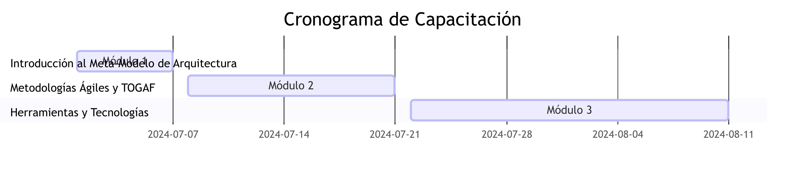

# Programa de Capacitación

## 1. Introducción

**Objetivo:** Desarrollar y ejecutar un programa de capacitación integral para el personal de DemoCompany, alineado con la implementación del meta-modelo de arquitectura y las nuevas metodologías y herramientas adoptadas.

## 2. Plan de Capacitación

### 2.1 Objetivos del Programa

- **Capacitar al personal en el uso del meta-modelo de arquitectura.**
- **Asegurar la adopción de metodologías ágiles y prácticas alineadas con TOGAF.**
- **Desarrollar competencias técnicas en las herramientas y tecnologías nuevas implementadas.**

### 2.2 Público Objetivo

- **Desarrolladores:** Formación en desarrollo ágil y uso del meta-modelo.
- **Arquitectos:** Capacitación en diseño arquitectónico según el meta-modelo.
- **Ingenieros de DevOps:** Formación en herramientas de CI/CD y prácticas de DevOps.
- **Ingenieros de QA:** Capacitación en automatización de pruebas y herramientas de QA.

### 2.3 Modalidades de Capacitación

- **Sesiones Presenciales:** Talleres y clases magistrales.
- **Sesiones Virtuales:** Webinars y cursos en línea.
- **Autoaprendizaje:** Materiales de estudio y guías disponibles en el portal de capacitación.

## 3. Estructura del Programa

### 3.1 Módulo 1: Introducción al Meta-Modelo de Arquitectura

- **Duración:** 1 semana
- **Contenido:**
  - Conceptos básicos del meta-modelo.
  - Componentes y relaciones del meta-modelo.
  - Casos de uso y ejemplos prácticos.
- **Recursos:**
  - Presentaciones.
  - Guías de usuario.
  - Ejercicios prácticos.

### 3.2 Módulo 2: Metodologías Ágiles y TOGAF

- **Duración:** 2 semanas
- **Contenido:**
  - Principios y prácticas ágiles.
  - Ciclo de vida de desarrollo ágil.
  - Alineación con TOGAF.
- **Recursos:**
  - Talleres interactivos.
  - Documentación de TOGAF.
  - Simulaciones de proyectos ágiles.

### 3.3 Módulo 3: Herramientas y Tecnologías

- **Duración:** 3 semanas
- **Contenido:**
  - Herramientas de CI/CD (e.g., Jenkins, GitLab CI).
  - Plataformas de contenedores y orquestación (e.g., Docker, Kubernetes).
  - Automatización de pruebas (e.g., Selenium, JUnit).
- **Recursos:**
  - Tutoriales en línea.
  - Laboratorios prácticos.
  - Materiales de referencia.

## 4. Cronograma de Capacitación

## 5. Evaluación y Certificación

### 5.1 Evaluaciones

- **Evaluaciones de Conocimiento:** Pruebas teóricas al final de cada módulo.
- **Evaluaciones Prácticas:** Ejercicios prácticos y proyectos al final de cada módulo.

### 5.2 Certificación

- **Certificación de Competencia:** Otorgada a los participantes que completen todos los módulos y aprueben las evaluaciones.
- **Certificación Avanzada:** Otorgada a aquellos que demuestren un nivel de competencia superior en las evaluaciones prácticas.

## 6. Recursos Adicionales

- **Portal de Capacitación:** Plataforma en línea con acceso a todos los materiales de capacitación, foros de discusión y soporte técnico.
- **Mentoría:** Acceso a mentores expertos para asistencia personalizada y resolución de dudas.
- **Materiales de Referencia:** Documentación, guías y recursos adicionales para profundizar en los temas cubiertos.

## 7. Conclusión

El programa de capacitación está diseñado para equipar al personal de DemoCompany con las habilidades y conocimientos necesarios para utilizar el meta-modelo de arquitectura y las nuevas metodologías y herramientas de manera efectiva. Esto asegurará una transición suave y exitosa hacia la nueva arquitectura tecnológica de la organización.

---

**Enlaces Relacionados:**
- [Guía del Meta-Modelo](docs/Guia_del_Meta_Modelo.md)
- [Manuales de Usuario](docs/Manuales_de_Usuario.md)
- [Casos de Uso](docs/Casos_de_Uso.md)
