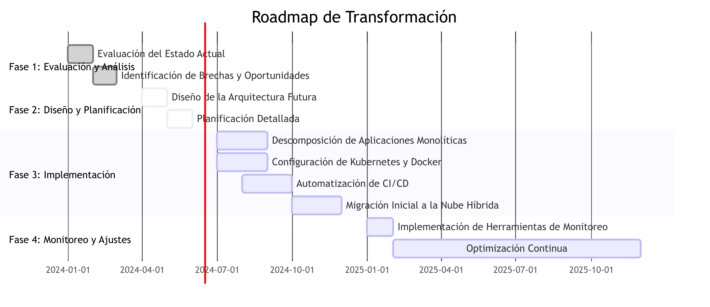
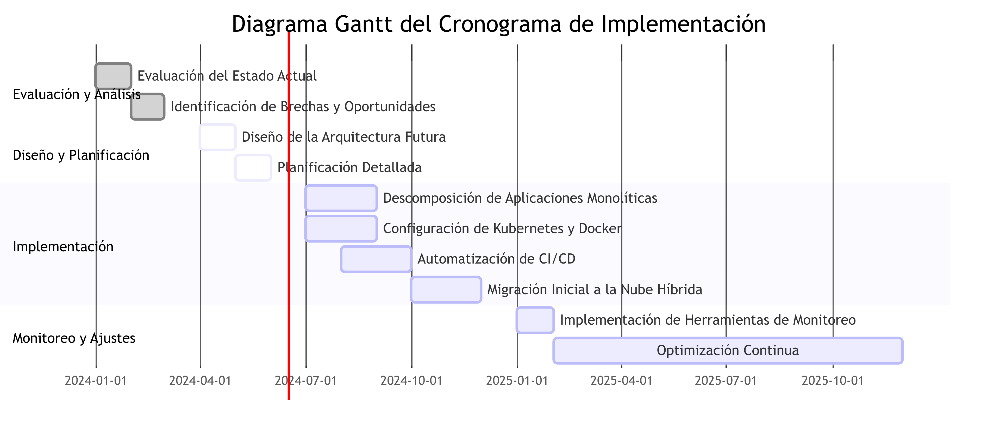
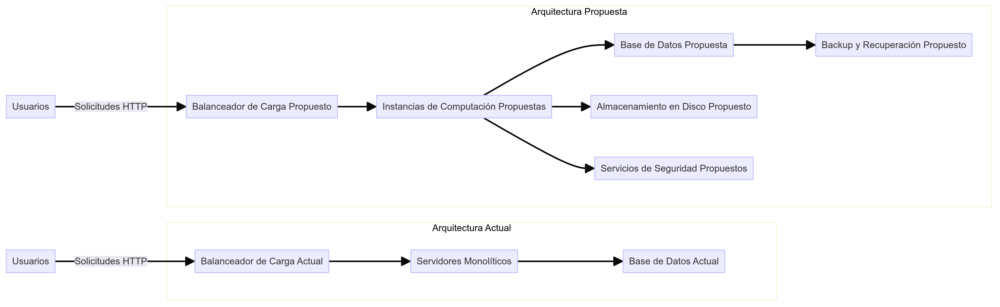

# Propuesta de Arquitectura

## 1. Introducción

**Objetivo:** Desarrollar una propuesta de arquitectura detallada para la transformación de la infraestructura tecnológica de DemoCompany, asegurando que se cumplan las necesidades de escalabilidad, flexibilidad y eficiencia operativa.

## 2. Requisitos

**Requisitos Funcionales:**
- Escalabilidad horizontal para manejar incrementos de carga.
- Alta disponibilidad para garantizar tiempos de actividad cercanos al 100%.
- Redundancia de datos para evitar pérdidas y asegurar la recuperación rápida.

**Requisitos No Funcionales:**
- Seguridad y cumplimiento de normativas.
- Rendimiento óptimo con tiempos de respuesta menores a 100 ms.
- Mantenimiento y operabilidad sencilla.

## 3. Diseño de la Arquitectura Propuesta

**3.1. Componentes de la Arquitectura**

- **Instancias de Computación:** 10 instancias (t2.medium en AWS, Standard_B2s en Azure, n1-standard-1 en Google Cloud).
- **Almacenamiento:** 5 TB de almacenamiento en disco.
- **Transferencia de Datos:** 10 TB de transferencia de datos salientes mensuales.
- **Servicios Adicionales:** Balanceadores de carga, bases de datos gestionadas, y servicios de seguridad.

**3.2. Justificación de Recursos**

- **Instancias de Computación:** 
  - Justificación: Basado en la carga actual y prevista, se estima que se necesitarán 10 instancias de computación para manejar las operaciones diarias y los picos de tráfico.
  - Métricas: Promedio de 1000 transacciones por segundo, con una carga promedio de CPU del 60% y un uso de memoria del 70%.

- **Almacenamiento:**
  - Justificación: Se requiere un total de 5 TB de almacenamiento para datos transaccionales, archivos de registro y copias de seguridad.
  - Métricas: Incremento mensual estimado de 100 GB de datos.

- **Transferencia de Datos:**
  - Justificación: Con un tráfico saliente estimado de 10 TB al mes, esto cubre las necesidades de transferencia de datos entre servicios, usuarios y sistemas externos.
  - Métricas: Análisis de tráfico saliente actual y proyección basada en el crecimiento esperado.

## 4. Servicios de Proveedores Cloud Evaluados

**AWS:**
- Instancias: t2.medium
- Almacenamiento: EBS (Elastic Block Store)
- Transferencia: S3 Transfer Acceleration
- Base de Datos: RDS (Relational Database Service)
- Seguridad: IAM (Identity and Access Management), KMS (Key Management Service)

**Microsoft Azure:**
- Instancias: Standard_B2s
- Almacenamiento: Managed Disks
- Transferencia: Azure CDN
- Base de Datos: Azure SQL Database
- Seguridad: Azure AD (Active Directory), Key Vault

**Google Cloud:**
- Instancias: n1-standard-1
- Almacenamiento: Persistent Disks
- Transferencia: Cloud CDN
- Base de Datos: Cloud SQL
- Seguridad: IAM, KMS

**IBM Cloud:**
- Instancias: bx2-2x8
- Almacenamiento: IBM Cloud Block Storage
- Transferencia: IBM Cloud CDN
- Base de Datos: Db2 on Cloud
- Seguridad: IAM, Key Protect

**Oracle Cloud:**
- Instancias: VM.Standard2.1
- Almacenamiento: Oracle Cloud Block Volumes
- Transferencia: Oracle Cloud Infrastructure FastConnect
- Base de Datos: Autonomous Database
- Seguridad: IAM, Vault

## 5. Diagramas

### Diagrama de Arquitectura Propuesta

### Roadmap de Transformación

### Diagrama Gantt del Cronograma de Implementación

### Diagrama de relacion de entidades, actual vs propuesta

